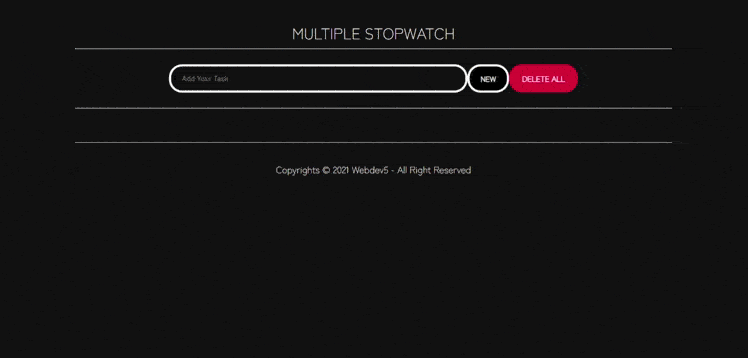

<div id="top"></div>
<!--
*** Thanks for checking out the Best-README-Template. If you have a suggestion
*** that would make this better, please fork the repo and create a pull request
*** or simply open an issue with the tag "enhancement".
*** Don't forget to give the project a star!
*** Thanks again! Now go create something AMAZING! :D
-->

<!-- PROJECT SHIELDS -->
<!--
*** I'm using markdown "reference style" links for readability.
*** Reference links are enclosed in brackets [ ] instead of parentheses ( ).
*** See the bottom of this document for the declaration of the reference variables
*** for contributors-url, forks-url, etc. This is an optional, concise syntax you may use.
*** https://www.markdownguide.org/basic-syntax/#reference-style-links
-->

[![Contributors][contributors-shield]][contributors-url]
[![Forks][forks-shield]][forks-url]
[![Stargazers][stars-shield]][stars-url]
[![Issues][issues-shield]][issues-url]
[![MIT License][license-shield]][license-url]

<!-- PROJECT LOGO -->
<br />
<div align="center">
  <a href="https://github.com/WebDev-5/kel5-timer-frontend-vue">
    
  </a>

  <h3 align="center">Multi Stopwatch Kelompok 5</h3>

  <p align="center">
    An awesome Stopwatch to manage your time!
    <br />
    <a href="#installation"><strong>Open Application »</strong></a>
    <br />
    <br />
    <a href="#usage">View Demo</a>
    ·
    <a href="https://github.com/WebDev-5/kel5-timer-frontend-vue/issues">Report Bug</a>
    ·
    <a href="https://github.com/WebDev-5/kel5-timer-frontend-vue/issues">Request Feature</a>
  </p>
</div>


<!-- TABLE OF CONTENTS -->
<details>
  <summary>Table of Contents</summary>
  <ol>
    <li>
      <a href="#about-the-project">About The Project</a>
      <ul>
        <li><a href="#built-with">Built With</a></li>
      </ul>
    </li>
    <li>
      <a href="#getting-started">Getting Started</a>
      <ul>
        <li><a href="#installation">Installation</a></li>
      </ul>
    </li>
    <li><a href="#usage">Usage</a></li>
    <li><a href="#roadmap">Roadmap</a></li>
    <li><a href="#contributing">Contributing</a></li>
    <li><a href="#license">License</a></li>
    <li><a href="#contact">Contact</a></li>
    <li><a href="#acknowledgments">Acknowledgments</a></li>
  </ol>
</details>


<!-- ABOUT THE PROJECT -->
## About The Project

[![Product Name Screen Shot][product-screenshot]](https://github.com/WebDev-5/kel5-timer-frontend-vue)

Multi Stopwatch is an application that was built to fulfill a mini project assignment for Web Development course, which was developed by Webdev Kelompok 5 D4 2019 Politeknik Negeri Bandung.
This an application that is a simulation of a stopwatch or timer, which can be used to calculate and set the time for each activity you do. This application is built using HTML, CSS, Node.js, Express.js, Sequelize, Axios, Vue.js, and PostgreSQL. This repository is FrontEnd part of the projec from manother part at https://github.com/WebDev-5/kel5-timer-backend-nodeJS. So, this part is just built using HTML, CSS, Express.js, Vue.js, and Axios.
Still remember, take advantage and don't waste your time!

The following are the features of this application :
1. Play, Pause, Restart and Stop.
2. Added a title for each timer.
3. Multi-timer feature, which supports multiple activities. And they will not run in parallel.
4. Keep running in the background, even if the application is closed.
5. Displays the total time taken.

<p align="right">(<a href="#top">back to top</a>)</p>


### Built With

The following are the frameworks and libraries that build this application :

* [HTML](https://developer.mozilla.org/en-US/docs/Web/HTML/)
* [CSS](https://developer.mozilla.org/en-US/docs/Web/CSS)
* [Express.js](https://expressjs.com/)
* [Vue.js](https://vuejs.org)
* [Axios](https://axios-http.com/docs/intro)

<p align="right">(<a href="#top">back to top</a>)</p>


<!-- GETTING STARTED -->
## Getting Started

This will give instructions on setting up your project locally.
To get a local copy up and running follow these simple example steps.

### Installation

1. Visit BackEnd repository of this project at https://github.com/WebDev-5/kel5-timer-backend-nodeJS and then folllow the instructions of installation.
2. Open terminal and install `vue-cli` globally.
    ```sh
   npm install vue-cli -g
   ```
3. Clone the repository.
   ```sh
   git clone https://github.com/WebDev-5/kel5-timer-frontend-vue
   ```
4. Open terminal and change directory to root folder.
    ```sh
   cd kel5-timer-frontend-vue
   ```
5. Install the dependencies.
   ```sh
   npm install
   ```
6. Run server.
   ```sh
   npm run serve -- --port 8081
   ```
7. Open your browsser and visit `http://localhost:8081`.
8. Run application.
   
<p align="right">(<a href="#top">back to top</a>)</p>


<!-- USAGE EXAMPLES -->
## Usage

To use this application, you can :
1. Create a new timer, by entering a title and then clicking the `Add` button.
2. Use the `Play` to start the timer.
3. Use the `Pause` to pause the timer.
4. Use the `Restart` to restart the timer from the beginning.
5. Use the `Stop` to stop the timer and display the total elapsed time.
6. Use the `x` in the corner to close and remove the timer.
7.  Use the `Remove All`  to close and remove the all timers.

For example :

[](https://github.com/WebDev-5/kel5-timer-frontend-vue)

<p align="right">(<a href="#top">back to top</a>)</p>


<!-- ROADMAP -->
## Roadmap

- [x] Analysis
- [x] Mock-Up design
- [x] Development HTML and CSS
- [x] Add script Vanilla.js
- [x] Add local storage to keep running in the background.
- [x] Add multiple timer feature.
- [x] Fix and update local storage.  
- [x] Fix and remove display bug. 
- [x] Build API in backend with Express.js, Sequelize, and Postgre. 
- [x] Remove localstorage and change to database.
- [x] Connect backend to frontend with Axios.  
- [x] Fix connection between frontend and backend. 

See the [open issues](https://github.com/WebDev-5/kel5-timer-frontend-vue/issues) for a full list of proposed features (and known issues).

<p align="right">(<a href="#top">back to top</a>)</p>


<!-- CONTRIBUTING -->
## Contributing

Contributions are what make the open source community such an amazing place to learn, inspire, and create. Any contributions you make are **greatly appreciated**.

If you have a suggestion that would make this better, please fork the repo and create a pull request. You can also simply open an issue with the tag "enhancement".
Don't forget to give the project a star! Thanks again!

1. Fork the Project
2. Create your Feature Branch (`git checkout -b feature/AmazingFeature`)
3. Commit your Changes (`git commit -m 'Add some AmazingFeature'`)
4. Push to the Branch (`git push origin feature/AmazingFeature`)
5. Open a Pull Request

<p align="right">(<a href="#top">back to top</a>)</p>


<!-- LICENSE -->
## License

Distributed under the MIT License. See [LICENSE.md](https://github.com/WebDev-5/kel5-timer-frontend-vue/blob/main/LICENSE.md) for more information.

<p align="right">(<a href="#top">back to top</a>)</p>


<!-- CONTACT -->
## Contact

* [Azhar Subhan Fauzi](https://github.com/vdbay)
* [Friska Intan Muta'alliy](https://github.com/friskaim7)
* [Meta Arda Nabila](https://github.com/metardn)
* [Mohammad Rizky Maulidhan](https://github.com/mrizkymaulidhan)
* [Nabil Putra Hadiyani](https://github.com/nabilputrah)
* [Shinta Nurkaafi](https://github.com/NurMeiTaa)

1. Project Link (BackEnd) : [Multiple Stopwatch Kelompok 5 (BackEnd)](https://github.com/WebDev-5/kel5-timer-backend-nodeJS)
2. Project Link (FrontEnd) : [Multiple Stopwatch Kelompok 5 (FrontEnd)](https://github.com/WebDev-5/kel5-timer-frontend-vue)

<p align="right">(<a href="#top">back to top</a>)</p>


<!-- ACKNOWLEDGMENTS -->
## Acknowledgments

We've included a few of our favorites to kick things off!

* [Img Shields](https://shields.io)
* [Readme Template](https://github.com/othneildrew/Best-README-Template)
* [Example CRUD Rest APIs](https://www.bezkoder.com/node-express-sequelize-postgresql/)

<p align="right">(<a href="#top">back to top</a>)</p>


<!-- MARKDOWN LINKS & IMAGES -->
<!-- https://www.markdownguide.org/basic-syntax/#reference-style-links -->
[contributors-shield]: https://img.shields.io/badge/CONTRIBUTORS-6-blue?style=for-the-badge&logo=appveyor
[contributors-url]: https://github.com/WebDev-5/kel5-timer-frontend-vue/graphs/contributors
[forks-shield]: https://img.shields.io/github/forks/WebDev-5/kel5-timer-frontend-vue?style=for-the-badge&logo=appveyor
[forks-url]: https://github.com/WebDev-5/kel5-timer-frontend-vue/network/members
[stars-shield]: https://img.shields.io/github/stars/WebDev-5/kel5-timer-frontend-vue?style=for-the-badge&logo=appveyor
[stars-url]: https://github.com/WebDev-5/kel5-timer-frontend-vue/stargazers
[issues-shield]: https://img.shields.io/github/issues/WebDev-5/kel5-timer-frontend-vue?style=for-the-badge&logo=appveyor
[issues-url]: https://github.com/WebDev-5/kel5-timer-frontend-vue/issues
[license-shield]: https://img.shields.io/github/license/WebDev-5/kel5-timer-frontend-vue?style=for-the-badge&logo=appveyor
[license-url]: https://github.com/WebDev-5/kel5-timer-frontend-vue/blob/main/LICENSE.md
[product-screenshot]: src/assets/images/screenshot.png
